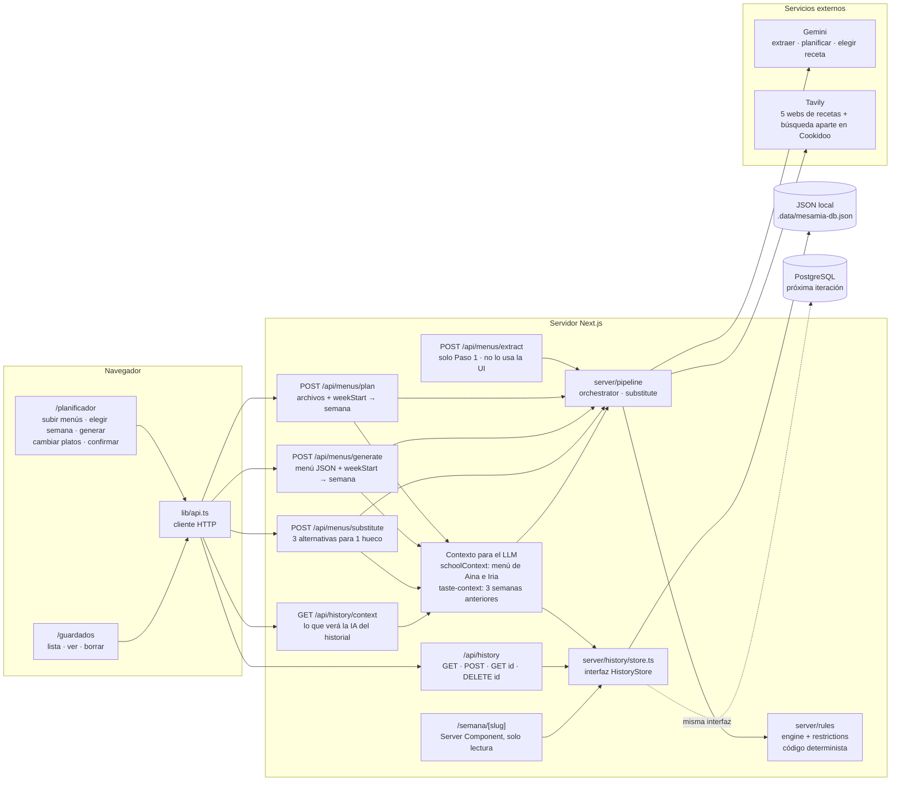
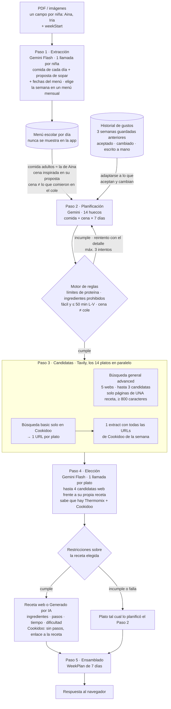
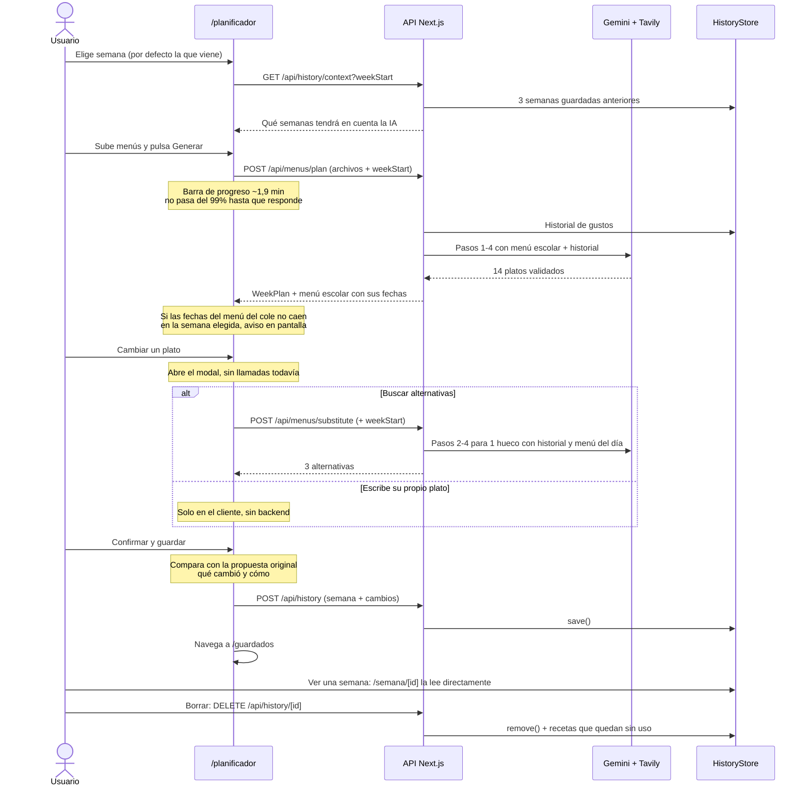
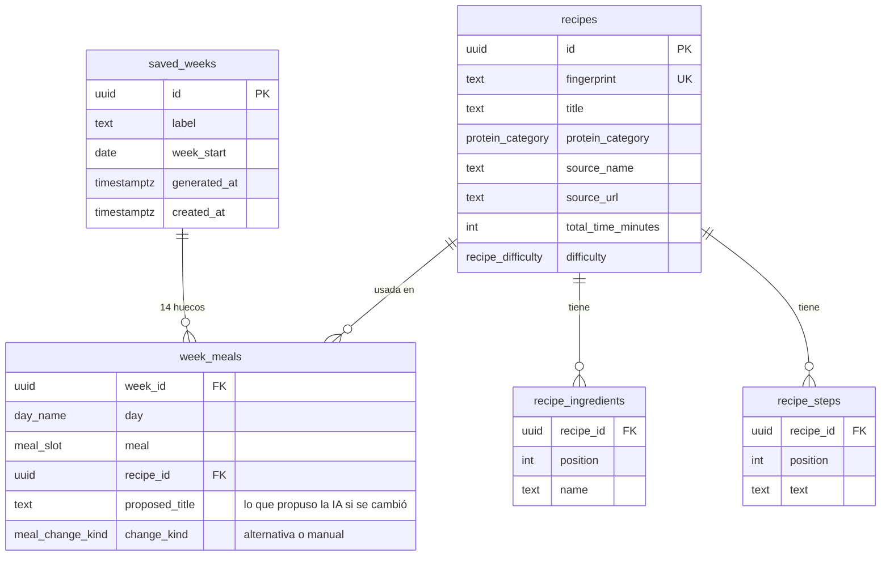

# Arquitectura de MesaMía

Cuatro diagramas, de lo general a lo concreto. Reflejan el código a 28 de septiembre de 2026; si
cambia el pipeline, las rutas o el modelo de datos, actualízalos aquí. Los detalles de cada pieza
están en `CLAUDE.md` y `server/README.md`.

Dos ideas para leerlos:

- **Reglas obligatorias frente a orientación.** Las obligatorias las comprueba siempre el código
  (`server/rules/`): límites semanales de proteína, ingredientes prohibidos, recetas fáciles y de
  ≤ 50 min de lunes a viernes, y que la cena no repita lo del cole. Lo que es orientación lo decide
  la IA: que la comida se parezca a la de Aina, inspirarse en la "proposta de sopar" y adaptarse a
  los gustos del historial.
- **El historial de gustos no se guarda aparte.** Se calcula en el momento a partir de las semanas
  guardadas: cada `week_meals` sabe si la familia aceptó la propuesta de la IA o la cambió, y por
  qué plato.

## 1. Arquitectura general

## 2. Pipeline de generación de la semana (`POST /api/menus/plan`)

`POST /api/menus/generate` hace lo mismo sin el Paso 1. `POST /api/menus/substitute` repite los
pasos 2 a 4 para un solo hueco y devuelve 3 alternativas, con 2 intentos como máximo. También recibe
el historial y el menú escolar de ese día.

## 3. Recorrido del usuario

## 4. Modelo de datos (histórico de Guardados)

El esquema completo, con tipos y restricciones, está en `server/db/schema.sql`.

